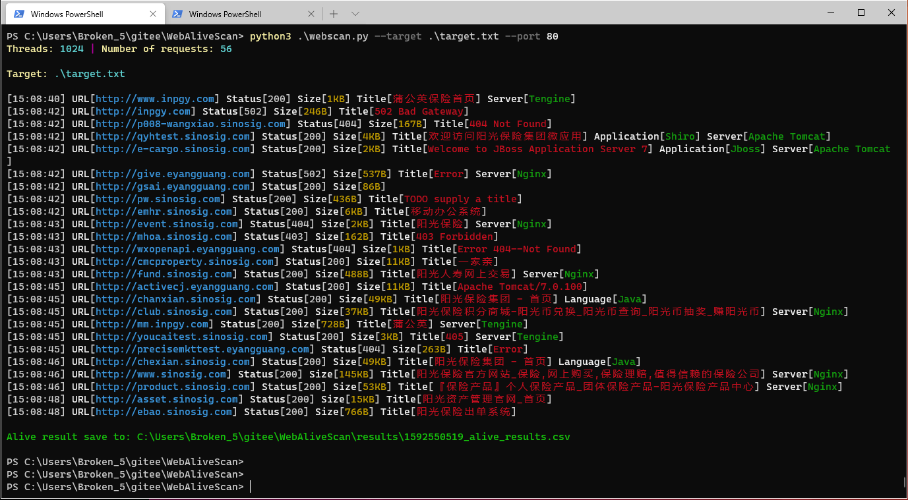

# WebAliveScan
安装
```
pip3 install -r requirements.txt -i https://mirrors.aliyun.com/pypi/simple/
```

使用帮助：
```
python3 webscan.py --target target.txt --port 80
python3 webscan.py --target target.txt --port large

```

##### v1.1增加忽略指定HTTP状态
```
config.py

# 可以指定需要忽略HTTP状态码
ignore_status_code = [400]

# 指定线程数量
threads = 1024
```


##### v1.2增加单个目标自定义端口
```
python3 webscan.py --target target.txt --port 80

target.txt
# 扫描--port指定的80
www.google.com

# 扫描www.baidu.com的443
www.baidu.com:443
```


##### v1.3增加快速目录扫描
```
python3 webscan.py --target target.txt --port 80 --brute True

可以在rules.py配置目录扫描的规则，这里的目录扫描目的是快速定位更脆弱的资产，跟传统的目录扫描有所不同
目前扫描规则包括ueditor、kindeditor、solr、axis、spring、weblogic
```


##### v1.4增加简单的指纹识别、修改输出样式


